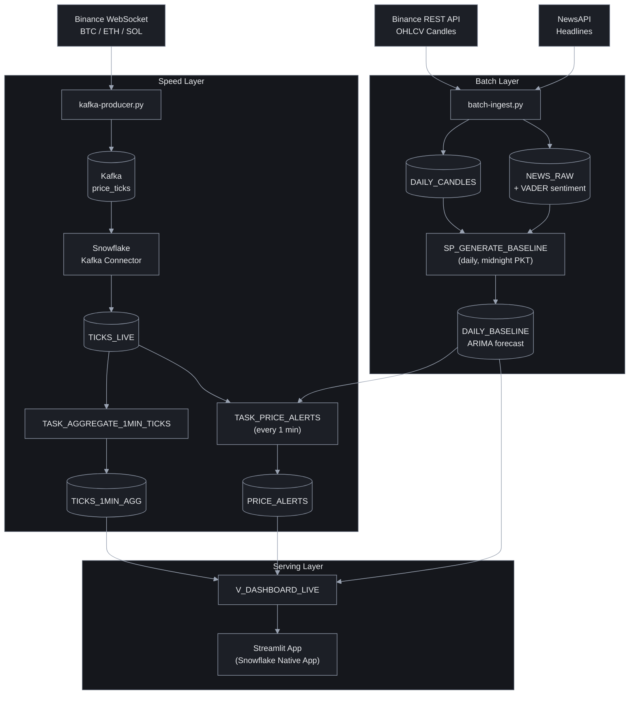

# Crypto Pulse

A Lambda architecture pipeline that streams live cryptocurrency trade ticks (BTC, ETH, SOL) from Binance into Snowflake via Kafka, enriches them with daily ARIMA-based price forecasts and news sentiment, and surfaces everything in a Streamlit dashboard with real-time price alerts.

---

## Architecture

```
Binance WebSocket
      │
      ▼
kafka-producer.py  ──►  Kafka (price_ticks)  ──►  Snowflake Kafka Connector
                                                          │
                                                          ▼
                                                     TICKS_LIVE
                                                          │
                                          ┌───────────────┴───────────────┐
                                          ▼                               ▼
                               TASK_AGGREGATE_1MIN_TICKS        TASK_PRICE_ALERTS
                               (TICKS_1MIN_AGG)                 (PRICE_ALERTS)

batch-ingest.py  ──►  DAILY_CANDLES + NEWS_RAW  ──►  SP_GENERATE_BASELINE  ──►  DAILY_BASELINE

                                          ▼
                               V_DASHBOARD_LIVE  ──►  Streamlit App
```

### Diagram



---

## Project Structure

```
snowflake-kafka-crypto-pulse/
├── config/
│   └── snowflake-sink.json           # Kafka Connect connector config
├── Snowflake/Snowflake/
│   ├── SQL/
│   │   ├── Database_Defination.sql   # DDL: tables, streams, tasks
│   │   ├── Kafka_Connector_Setup.sql # Kafka connector role, user, and key registration
│   │   └── Transformation.sql        # Views, stored procedures, alert tasks
│   └── Streamlit/
│       └── streamlit_app.py          # Snowflake-native Streamlit dashboard
├── src/
│   ├── batch/
│   │   └── batch-ingest.py       # Pulls Binance candles + NewsAPI headlines
│   └── stream/
│       └── kafka-producer.py     # Streams live trades to Kafka
├── .env.example                  # Environment variable template
└── pyproject.toml
```

---

## Prerequisites

- Python >= 3.10 (managed via `uv`)
- Apache Kafka running on `localhost:9092`
- Kafka Connect with the [Snowflake Kafka Connector](https://docs.snowflake.com/en/user-guide/kafka-connector) installed
- A Snowflake account
- A [NewsAPI](https://newsapi.org) key (optional — batch news ingestion skips gracefully without it)

---

## Setup

### 1. Install dependencies

```bash
pip install uv
uv sync
```

### 2. Generate RSA key pair for Snowflake authentication

```bash
# Generate encrypted private key (you will be prompted for a passphrase)
openssl genrsa 2048 | openssl pkcs8 -topk8 -v2 aes256 -inform PEM -out rsa_key.p8

# Generate public key from the private key
openssl rsa -in rsa_key.p8 -pubout -out rsa_key.pub
```

To generate an **unencrypted** private key (no passphrase):

```bash
openssl genrsa 2048 | openssl pkcs8 -topk8 -nocrypt -inform PEM -out rsa_key.p8
openssl rsa -in rsa_key.p8 -pubout -out rsa_key.pub
```

### 3. Register the public key with your Snowflake user

Run this in a Snowflake worksheet, replacing `<YOUR_USERNAME>` and `<PUBLIC_KEY_CONTENT>`:

```sql
ALTER USER <YOUR_USERNAME> SET RSA_PUBLIC_KEY='<PUBLIC_KEY_CONTENT>';
```

The public key content is everything between `-----BEGIN PUBLIC KEY-----` and `-----END PUBLIC KEY-----` in `rsa_key.pub`, with newlines removed.

### 4. Configure environment variables

```bash
cp .env.example .env
```

Edit `.env` with your credentials:

| Variable | Description |
|---|---|
| `NEWS_API_KEY` | API key from [newsapi.org](https://newsapi.org) |
| `SNOWFLAKE_ACCOUNT` | Account identifier (e.g. `orgname-accountname`) |
| `SNOWFLAKE_USER` | Snowflake username |
| `SNOWFLAKE_PRIVATE_KEY_PATH` | Path to `rsa_key.p8` (default: `./rsa_key.p8`) |
| `SNOWFLAKE_PRIVATE_KEY_PASSPHRASE` | Passphrase used when generating the key (leave empty if unencrypted) |
| `SNOWFLAKE_DATABASE` | `CRYPTO_PULSE_DB` |
| `SNOWFLAKE_SCHEMA` | `PUBLIC` |
| `SNOWFLAKE_WAREHOUSE` | `CRYPTO_PULSE_WH` |
| `SNOWFLAKE_ROLE` | Role with access to the database |

### 5. Configure the Kafka connector

Edit `config/snowflake-sink.json` and replace the following fields:

| Field | Where to update |
|---|---|
| `snowflake.url.name` | Your Snowflake account URL (e.g. `<orgname>-<accountname>.snowflakecomputing.com`) |
| `snowflake.user.name` | Snowflake user for the connector (e.g. `KAFKA_CONNECTOR_USER`) |
| `snowflake.private.key` | Base64-encoded DER private key — extract with the command below |
| `snowflake.database.name` | `CRYPTO_PULSE_DB` |
| `snowflake.schema.name` | `PUBLIC` |
| `snowflake.role.name` | Role assigned to the connector user |

To extract the Base64 private key for the connector config:

```bash
# Outputs the raw base64 string to paste into snowflake.private.key
openssl pkcs8 -in rsa_key.p8 -nocrypt -outform DER | base64 | tr -d '\n'
```

Then deploy the connector:

```bash
curl -X POST http://localhost:8083/connectors \
  -H "Content-Type: application/json" \
  -d @config/snowflake-sink.json
```

### 6. Set up the Kafka connector user in Snowflake

Run `Snowflake/Snowflake/SQL/Kafka_Connector_Setup.sql` in a Snowflake worksheet. This creates the `KAFKA_CONNECTOR_ROLE` and `KAFKA_CONNECTOR_USER` and grants the required permissions.

Before running, replace the placeholder on this line with your public key (contents of `rsa_key.pub`, newlines removed):

```sql
ALTER USER KAFKA_CONNECTOR_USER SET RSA_PUBLIC_KEY='<RSA_PUBLIC_KEY_STRING>';
```

### 7. Initialize Snowflake schema

Run `Snowflake/Snowflake/SQL/Database_Defination.sql` in a Snowflake worksheet to create the warehouse, database, tables, stream, and aggregation task.

Then run `Snowflake/Snowflake/SQL/Transformation.sql` to create views, the baseline stored procedure, and alert tasks.

---

## Running the Pipeline

### Stream layer — live trade ticks

```bash
uv run python src/stream/kafka-producer.py
```

Connects to Binance WebSocket streams for BTCUSDT, ETHUSDT, and SOLUSDT and publishes raw trade events to the `price_ticks` Kafka topic.

### Batch layer — daily candles + news

```bash
uv run python src/batch/batch-ingest.py
```

Fetches the last 30 days of OHLCV candles from Binance REST API and the latest crypto headlines from NewsAPI (with VADER sentiment scoring), then upserts them into Snowflake.

---

## Snowflake Automation

| Object | Schedule | Purpose |
|---|---|---|
| `TASK_AGGREGATE_1MIN_TICKS` | Every 1 minute | Aggregates raw ticks into 1-min OHLCV candles (`TICKS_1MIN_AGG`) |
| `TASK_DAILY_BASELINE` | Daily at midnight PKT | Runs `SP_GENERATE_BASELINE` to produce ARIMA price forecast bands |
| `TASK_PRICE_ALERTS` | Every 1 minute | Detects ticks outside the predicted range and writes to `PRICE_ALERTS` |

---

## Dashboard

The Streamlit app (`Snowflake/Snowflake/Streamlit/streamlit_app.py`) is deployed as a Snowflake Native App. It shows:

- Live price line chart with ARIMA forecast band
- KPI metrics: live price, predicted range, current status
- Deviation chart (position within predicted band %)
- Recent price alert history table

Deploy via the Snowflake UI or `snowflake.yml` in the Streamlit directory.
